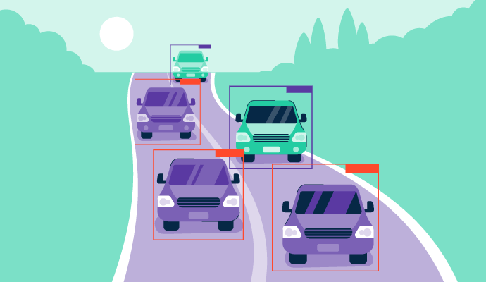

<div align="center">

# YOLOv8_Object_detection_v1.0_app

  <p>
    <a align="center" target="_blank">
      </a><br>
     <a align="center" href="https://ultralytics.com/yolov8" target="_blank">
      </a>
  </p>

<br>

<div>
   <a href="https://github.com/ultralytics/ultralytics/actions/workflows/ci.yaml"></a>
    <a href="https://colab.research.google.com/drive/1shMJ1F6XbzQOBSlxvoEbnkgoJPngVLvs?usp=sharing"></a>
  </div>
  <br>
</div>

## Введение / Introduction
### RUS: 
- Этот репозиторий предоставляет удобный интерактивный интерфейс для [YOLOv8](https://github.com/ultralytics/ultralytics), и этот интерфейс создан на базе [Streamlit](https://github.com/streamlit/streamlit).<br>
- В таблицу ниже, помимо стандартных моделей, включены модели, обученные на основе датасетов с [Roboflow](https://universe.roboflow.com/):
  - Определение автомобильных номеров - [Car plate detection Computer Vision Project](https://universe.roboflow.com/plate-detection-8sa0a/car-plate-detection-vbivf) 
  - Определение транспортных средств при разном времени суток и погодных условиях - [Smart city cars detection Computer Vision Project](https://universe.roboflow.com/simone-bernabe/smart-city-cars-detection)
### ENG:
- This repository supply a user-friendly interactive interface for [YOLOv8](https://github.com/ultralytics/ultralytics) and the interface is powered by [Streamlit](https://github.com/streamlit/streamlit)
- The table below, in addition to standard models, includes models trained based on datasets from [Roboflow](https://universe.roboflow.com/):
  - Determination of license plates - [Car plate detection Computer Vision Project](https://universe.roboflow.com/plate-detection-8sa0a/car-plate-detection-vbivf)
  - Identification vehicles under different times of day and weather conditions - [Smart city cars detection Computer Vision Project](https://universe.roboflow.com/simone-bernabe/smart-city-cars-detection)

## Функции / Features
### RUS:
- Доступные типы задачи: Обнаружение транспорта, обнаружение гос.номера автомобиля, сегментация, обнаружения объектов
- Доступные модели обнаружения/сегментации: `DetlicPl_s` `DetlicPl_l` `Veh_Det` `yolov8n`, `yolov8s`, `yolov8m`, `yolov8l`, `yolov8x` `yolov8n-seg`, `yolov8s-seg`, `yolov8m-seg`, `yolov8l-seg`, `yolov8x-seg`
- Несколько входных форматов: `Изображение`, `Видео`, `Вебкамера`
### ENG:
- Available task types: Vehicle detection, license plate detection, segmentation, object detection.
- Available detection/segmentation models: `DetlicPl_s` `DetlicPl_l` `Veh_Det` `yolov8n`, `yolov8s`, `yolov8m`, `yolov8l`, `yolov8x` `yolov8n-seg`, `yolov8s-seg`, `yolov8m-seg`, `yolov8l-seg`, `yolov8x-seg`
- Multiple input formats: Multiple input formats. `Image`, `Video`, `Webcam`

## Интерактивный интерфейс / Interactive Interface
### Интерфейс ввода изображения / Image Input Interface
<br>


### Интерфейс ввода видео / Video Input Interface


### Интерфейс ввода веб-камеры / Webcam Input Interface


## Установка / Installation
### Скачать и распаковать репозиторий / Download and unzip repository
```commandline
https://github.com/yaroslavski88/Yolov8_Object_detection_v1.0_app
```
### Открыть Терминал/ Open Terminal
```commandline
https://github.com/yaroslavski88/Yolov8_Object_detection_v1.0_app
### Установить пакеты / Install packages
```commandline
# yolov8 dependencies
pip install ultralytics

# Streamlit dependencies
pip install streamlit
```
### Загрузите предварительно обученные веса обнаружения YOLOv8 / Download Pre-trained YOLOv8 Detection Weights
- RUS: Создайте каталог с именем `weights`, создайте подкаталог с именем `detection` и сохраните загруженные веса обнаружения объектов YOLOv8 внутри этого каталога. Файлы весов можно скачать из таблиц ниже.<br>
- ENG: Create a directory named `weights` and create a subdirectory named `detection` and save the downloaded YOLOv8 object detection weights inside this directory. The weight files can be downloaded from the tables below.

| Обнаружение транспорта, обнаружение гос.номера автомобиля / Vehicle detection, license plate detection models|
| ------------------------------------------------------------------------------------------------------------ |
| [DetlicPl_s](https://drive.google.com/drive/folders/1rxSLLwHc9jeHqOM5EAUcq3JxwpczEm5Z?usp=sharing) |
| [DetlicPl_l](https://drive.google.com/drive/folders/1rxSLLwHc9jeHqOM5EAUcq3JxwpczEm5Z?usp=sharing) |
| [Veh_Det](https://drive.google.com/drive/folders/1rxSLLwHc9jeHqOM5EAUcq3JxwpczEm5Z?usp=sharing) |
| Модели Yolov8 (Обнаружение) / Models Yolov8 (Detection)                                  |
| [YOLOv8n](https://github.com/ultralytics/assets/releases/download/v0.0.0/yolov8n.pt) |
| [YOLOv8s](https://github.com/ultralytics/assets/releases/download/v0.0.0/yolov8s.pt) |
| [YOLOv8m](https://github.com/ultralytics/assets/releases/download/v0.0.0/yolov8m.pt) |
| [YOLOv8l](https://github.com/ultralytics/assets/releases/download/v0.0.0/yolov8l.pt) |
| [YOLOv8x](https://github.com/ultralytics/assets/releases/download/v0.0.0/yolov8x.pt) |
| Модели Yolov8 (Сегментация) / Models Yolov8 (Segmentation)                                  |
| [YOLOv8n](https://github.com/ultralytics/assets/releases/download/v0.0.0/yolov8n-seg.pt) |
| [YOLOv8s](https://github.com/ultralytics/assets/releases/download/v0.0.0/yolov8s-seg.pt) |
| [YOLOv8m](https://github.com/ultralytics/assets/releases/download/v0.0.0/yolov8m-seg.pt) |
| [YOLOv8l](https://github.com/ultralytics/assets/releases/download/v0.0.0/yolov8l-seg.pt) |
| [YOLOv8x](https://github.com/ultralytics/assets/releases/download/v0.0.0/yolov8x-seg.pt) |

## Запуск / Run
```commandline
streamlit run app.py
```
- RUS: Затем запустится сервер Streamlit и автоматически откроется в веб-браузере страница Streamlit по умолчанию.<br>
- ENG: Then will start the Streamlit server and open your web browser to the default Streamlit page automatically.

